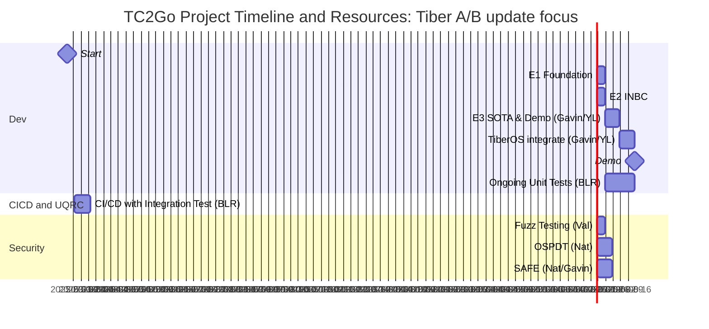

```mermaid
gantt
    title TC2Go Project Timeline and Resources: Tiber A/B update focus
    dateFormat  YYYY-MM-DD
    tickInterval 1week

    section Dev
        Start                             :milestone, :start, 2025-03-10, 0d
        E1 Foundation                     :foundation, after start, 1w
        E2 INBC                           :inbc, after start, 1w
        E3 SOTA & Demo (Gavin/YL)         :sotademo, after inbc, 2w
        TiberOS integrate (Gavin/YL) :spec, after sotademo, 2w
        Demo                              :milestone, :demo, after spec, 0d
        Ongoing Unit Tests (BLR)          :unit, after foundation, 4w        

    section CICD and UQRC
        CI/CD with Integration Test (BLR)         :cicd, 2025-03-17, 15d
    
    section Security
        Fuzz Testing (Val)                :fuzz, after demo, 1w
        OSPDT (Nat)                       :ospdt, after demo, 2w
        SAFE (Nat/Gavin)                  :safe, after demo, 2w
```
