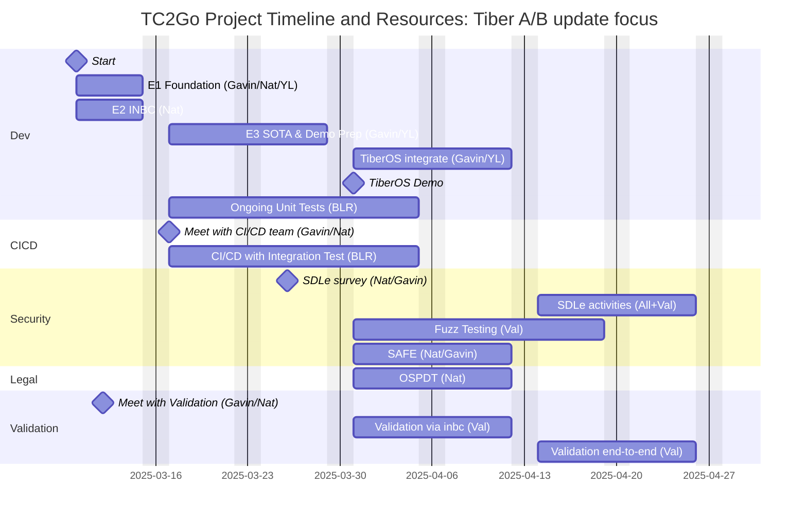

```mermaid
gantt
    title TC2Go Project Timeline and Resources: Tiber A/B update focus
    dateFormat  YYYY-MM-DD
    tickInterval 1week
    excludes weekends

    section Dev
        Start                             :milestone, :start, 2025-03-10, 0d
        E1 Foundation (Gavin/Nat/YL)    :foundation, 2025-03-10, 5d
        E2 INBC (Nat)                     :inbc, 2025-03-10, 5d
        E3 SOTA & Demo Prep (Gavin/YL)    :sotademo, after inbc, 10d
        TiberOS integrate (Gavin/YL) :spec, after sotademo, 10d
        TiberOS Demo                              :milestone, :demo, 2025-03-31, 0d
        Ongoing Unit Tests (BLR)          :unit, after foundation, 15d

    section CICD
        Meet with CI/CD team (Gavin/Nat)          :milestone, :meetcicd, 2025-03-17, 0d
        CI/CD with Integration Test (BLR)         :cicd, 2025-03-17, 15d
    
    section Security
        SDLe survey (Nat/Gavin)           :milestone, :survey, 2025-03-26, 0d
        SDLe activities (All+Val)         :sdle, after safe, 10d
        Fuzz Testing (Val)                :fuzz, 2025-03-31, 15d
        SAFE (Nat/Gavin)                  :safe, 2025-03-31, 10d

    section Legal
        OSPDT (Nat)                       :ospdt, 2025-03-31, 10d
    
    section Validation
        Meet with Validation (Gavin/Nat) :milestone, :meetval, 2025-03-12, 0d
        Validation via inbc (Val)        :valinbc, after sotademo, 10d
        Validation end-to-end (Val)      :vale2e, after spec, 10d
```
